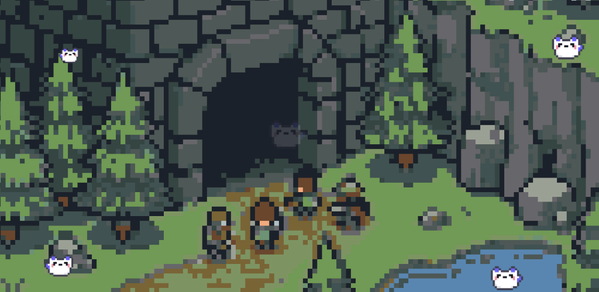

# PixelSync

**Pro pixel art creation & animation.**

Sync directly to Unity via Wi-Fi, extract real-world palettes, or draw with friends! 100% free, zero ads.

A pro-level pixel art suite in your pocket. PixelSync is a powerful, completely free editor built for indie game developers, digital artists, and retro enthusiasts. Whether you are creating static character sprites, crafting complex animations, or teaming up with a friend to draw in real-time, you get desktop-class workflow tools on the go.

  
  

    <!-- Slides will be injected here via JS -->
  

  <!-- Navigation Arrows -->
  <button id="pxs-prev" class="absolute left-2 md:left-8 z-30 w-12 h-12 flex items-center justify-center rounded-full bg-black/40 text-white backdrop-blur-md border border-white/10 hover:bg-black/70 hover:scale-110 transition-all">
    <svg width="24" height="24" viewBox="0 0 24 24" fill="none" stroke="currentColor" stroke-width="2"><path d="M15 18l-6-6 6-6"/></svg>
  </button>
  
  <button id="pxs-next" class="absolute right-2 md:right-8 z-30 w-12 h-12 flex items-center justify-center rounded-full bg-black/40 text-white backdrop-blur-md border border-white/10 hover:bg-black/70 hover:scale-110 transition-all">
    <svg width="24" height="24" viewBox="0 0 24 24" fill="none" stroke="currentColor" stroke-width="2"><path d="M9 18l6-6-6-6"/></svg>
  </button>
  
  <!-- Indicators -->
  

## Developer-Focused Features
- **Live Unity Sync:** Stop emailing yourself files. Connect over local Wi-Fi and watch every pixel and frame update instantly inside your Unity project.
- **Real-Time Collaboration:** Use a 6-digit room code to host a session and draw with friends live, complete with online presence badges. Also available over local network.
- **Pixel Mail (Home Screen Widget):** Surprise your friends with art! Connect with other artists and "drop" custom pixel creations straight to their device's home screen widget. It's a fun, seamless way to share inspiration without them ever needing to open the app.
- **Real-World Color Picker:** Open your device's camera inside the app and instantly extract custom pixel art palettes from your physical surroundings.
- **Desktop-Class Tools:** Isolate your art with infinite layers, frame-by-frame animation, pixel-perfect pencils, dithering brushes, and color replacement.
- **Game-Ready Exports:** Instantly export as PNGs, smart-scaled GIFs, sequential Spritesheets, or fully packaged Game Atlases (ZIP) ready for Unity and Godot.

## 100% Free & Community Powered
We believe creative tools shouldn't be hidden behind paywalls or annoying pop-up ads. PixelSync has zero subscriptions and zero ads. We rely entirely on optional, one-time "Tip Jar" donations to fund new features, keep the app ad-free, and pay for our multiplayer servers.

---
[Privacy Policy](/legal/pixelsync-privacy) • [Terms of Service](/legal/pixelsync-tos)
