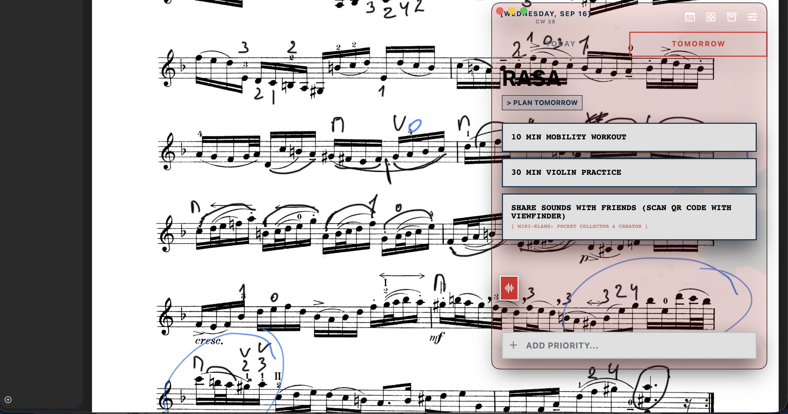

# Tabula

**Stop Planning. Start Executing.**

Most to-do lists are digital graveyards for things you will never do. Tabula is a minimalist execution engine that forces discipline, eliminates procrastination, and makes you ruthlessly prioritize your time.

## The Philosophy of the Blank Slate
To-do lists breed hoarding and guilt. Tabula is built on the concept of Tabula Rasa—the blank slate. We restrict your focus, sync seamlessly with your real-world calendar, and automatically burn whatever you don't finish. Every single day is a fresh start.

## Core Features
- **The Strict Slate:** You are strictly limited to 5 tasks a day. Swipe right to execute. Swipe left to undo. Limit your focus and do the work.
- **The Daily Wipe:** Every 24 hours at your chosen reset time, your slate is wiped clean. No rollovers. No guilt-tripping notifications. You either execute, or you let it burn.
- **Kanban Project Boards:** For larger goals, build your backlog on Kanban boards. When you are finally ready to execute, push a card directly to your daily slate.
- **Peer-to-Peer Kanban Sharing:** Stop working in a silo. Share your project boards with others by generating a secure, open link directly from your Google Drive. Because it is decentralized, your shared projects remain in your control—they never pass through our servers.
- **Contextual Calendar:** View your daily schedule right alongside your slate. See exactly how much time you actually have before you commit to a task.
- **AI Brain Dump (BYOK):** Got too much on your mind? Speak your chaotic thoughts into the app and let AI instantly structure them into actionable project tasks. Bring Your Own Key (BYOK) keeps you in total control of your data and usage.
- **"Life Happens" Mode:** A one-day pause button for the daily wipe when emergencies strike.

## Privacy & Ownership First
Tabula operates entirely on a privacy-first, decentralized model. We don't want your data.
- **Zero Subscriptions, Zero Ads:** Tabula is completely free and lightning-fast.
- **Local-First Database:** Your tasks, notes, and history live on your physical device. We have no access to your lists.
- **Your Own Cloud:** Effortless, secure two-way syncing across devices using your personal Google Drive.
- **Export Anything:** Full data ownership means you can export your entire history and project data to CSV instantly.

---
[Privacy Policy](/legal/tabula-privacy) • [Terms of Service](/legal/tabula-tos)
