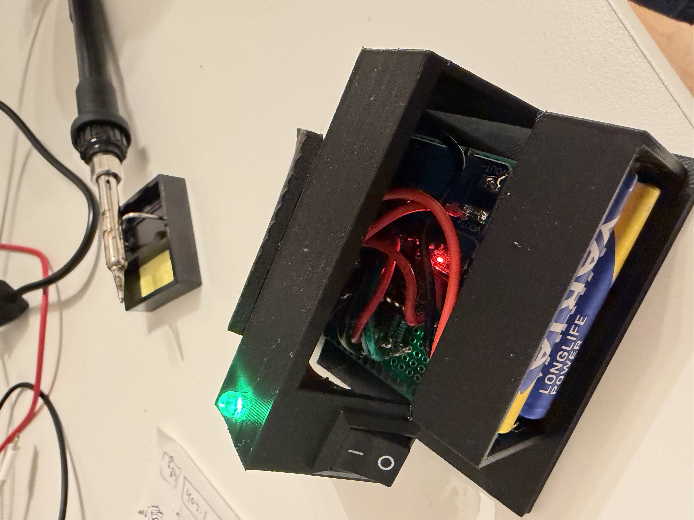

# LoopDaTune (LDT) Device

*Currently in development.*

The LoopDaTune (LDT) is a custom hardware device designed specifically to integrate deeply with the [DaTune](/apps/datune) app, bringing tactile, physical control to your digital workflow. 

Specializing in hands-free looper control, the LDT Device allows you to punch in, overdub, and clear layers effortlessly, keeping you entirely in the creative zone without ever touching your screen.

Stay tuned for more updates as we finalize the prototype!
